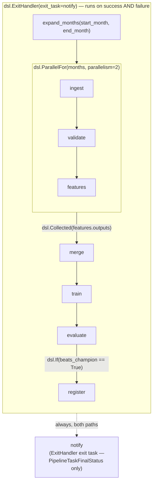

# nyc-trip-duration-kfp

A batch ML training pipeline on Kubeflow Pipelines v2, predicting NYC TLC trip duration (LightGBM regression) from monthly taxi trip records — built to demonstrate production-grade pipeline engineering (typed artifacts, custom component images, conditional model promotion, provable idempotent backfill), not to chase modeling accuracy.

## Status

**Phase 1 (repo foundation and CI quality gates) and Phase 2 (data & model engineering `lib/`) are complete.** `lib/` now holds the full pandas/numpy/pandera/LightGBM logic: chunked TLC Parquet ingest with a two-tier D-09a quality gate (`lib/ingest.py`, `lib/schemas.py`), a fully vectorized zone-centroid haversine distance feature with a specified dtype-downcasting contract (`lib/features.py`), a fixed-config LightGBM trip-duration regressor trained on a chronological pre/post-COVID split (`lib/train.py`), RMSE evaluation (`lib/evaluate.py`), and a mockable MLflow champion/candidate registry wrapper (`lib/registry.py`) — all unit-tested with 100% branch coverage on synthetic fixtures, per REQ-A3. See "Feature Engineering Benchmark" and "Dataset and Drift Window" below for the measured performance evidence and drift rationale. The Kubeflow Pipelines DAG, k3d cluster, MinIO, and MLflow integration remain Phase 3's scope. Do not mistake the current tree for the finished project — see `.planning/ROADMAP.md` for the full plan.

## Quick Start

```
uv sync --extra dev --extra ml
```

This repository's Python work targets the venv at `path/to/venv` (per `CLAUDE.MD`), resolved via `UV_PROJECT_ENVIRONMENT`. `scripts/qa.sh` resolves this from the script's own location on disk, not from the caller's working directory, so every command below works identically whether you run it from the repo root, `lib/`, or `components/ingest/`.

Five local commands cover every quality gate:

```
scripts/qa.sh lint        # ruff check .
scripts/qa.sh format      # ruff format --check .
scripts/qa.sh typecheck   # mypy --strict lib
scripts/qa.sh test        # pytest
scripts/qa.sh boundary    # scripts/check_component_boundary.sh
```

Every `uv` call inside the script passes `--extra dev --extra ml` (and `--frozen` under CI). A hand-run bare `uv run <tool>` implicitly syncs the default dependency set first, which uninstalls ruff/mypy/pytest/pandas/etc. from the venv as a side effect of running them — always use `scripts/qa.sh` rather than invoking `uv run` directly.

## Repository Layout

```
lib/          100%-unit-tested pandas/numpy/modeling logic, zero KFP imports
components/   thin KFP component wrappers — one dir per pipeline stage, each its own image
pipelines/    @dsl.pipeline DAG definitions, compiled to YAML
serving/      out of scope for this milestone (KServe deployment — deferred)
dashboard/    out of scope for this milestone (monitoring UI — deferred)
tests/        pytest suite, mirrors lib/
```

## Architectural Contract: Thin Component, Fat Lib

`lib/` holds 100% of the pandas and feature logic and imports nothing from KFP. A `components/` module parses its inputs, calls exactly one `lib` function, and writes its outputs — nothing else. This is enforced mechanically, not by review discipline: `scripts/check_component_boundary.sh` runs in both CI (as a step of the `lint` job) and every pre-commit run, and rejects three violation classes inside `components/`:

1. A `pandas` or `numpy` import (plain, dotted-submodule, or `from`-import form).
2. A DataFrame-shaped method call (`.groupby(`, `.merge(`, `.pivot(`, `.resample(`, `.apply(`, `.assign(`, `.astype(`, `.read_parquet(`, `.to_parquet(`, `.read_csv(`, `.to_csv(`).
3. A `packages_to_install` KFP decorator argument — component dependencies come from the CI-built image, never a pip install at pod start.

The gate also refuses to pass vacuously: if its scan of `components/` finds zero tracked Python modules, it exits non-zero rather than silently reporting success.

## Architecture

The contract above is enforced mechanically; this section shows the concrete DAG it produces. `pipelines/train_pipeline.py` compiles to the following graph — every node name below is a real `@dsl.component` function in `components/`, read directly out of that file rather than sketched from the plan:



**Three tiers, one direction of dependency.** `lib/` holds 100% of the pandas, pandera, LightGBM and MLflow logic and imports nothing from KFP. `components/` holds nine thin wrappers — one per node above — each reading a typed artifact's `.path`, making exactly one `lib` call, and writing a typed artifact's `.path`/`.metadata`. `pipelines/train_pipeline.py` holds only control flow: `ParallelFor`/`Collected`/`If`/`ExitHandler` wiring and per-task resource limits, never a `lib` import. `scripts/check_component_boundary.sh` mechanically enforces the first boundary (no pandas/numpy import, no DataFrame-shaped method call, no `packages_to_install` inside `components/`); nothing enforces the second by tooling, but `pipelines/train_pipeline.py` never imports `lib/` at all, so the boundary holds by construction.

**Artifact store / registry split.** KFP's `pipeline_root` (backed by KFP's own bundled object store) holds each run's intermediate artifact bytes — the `raw`/`validated`/`features`/`merged`/`model`/`metrics` typed artifacts flowing along the arrows above — and drives the KFP UI's lineage graph. It is run-scoped and ephemeral; treat it as plumbing, not a queryable record. MLflow, backed by its own dedicated MinIO bucket (`mlflow-artifacts`), holds the durable, queryable-across-runs champion record: registered model versions, RMSE history, and the `@champion`/`@candidate` aliases `lib/registry.py` drives. `evaluate` reads the champion RMSE from MLflow's `@champion` alias — never from a prior KFP run's artifacts — which is what makes a promotion decision comparable between two separate pipeline executions instead of only within one DAG run.

**A third bucket, `backfill`,** holds the deterministic per-month feature keys (`{version}/{stage}/{month}.parquet`, `lib/artifacts.py::artifact_key`) that REQ-B8's idempotency proof diffs. This is deliberately separate from KFP's run-scoped `pipeline_root` path, because a run-ID-scoped URI cannot be diffed across two separate runs of the same `start_month`/`end_month` range — the whole point of the deterministic key is that both runs write to the *same* address, overwriting rather than accumulating (`research/PITFALLS.md` Pitfall 5).

## Cluster Deployment

The runbook a reviewer follows to reproduce the stack. Four `deploy/` scripts, run in this order:

| Script | What it does | Verify |
|---|---|---|
| `deploy/01-cluster-up.sh` | Installs k3d (pinned `v5.9.0`, no sudo) if missing, then creates a single-node `mlops` k3d cluster with an advisory memory budget. | `kubectl get nodes` shows the node `Ready`. |
| `deploy/02-kfp-install.sh` | Installs KFP standalone `2.17.0` via the `env/platform-agnostic` kustomize overlay and verifies every running KFP image is pinned to that tag. | `kubectl get pods -n kubeflow` all `Running`/`Completed`; `kubectl get pods -n kubeflow -o jsonpath='{.items[*].spec.containers[*].image}'` shows every `ghcr.io/kubeflow/kfp-*` image at `:2.17.0`, never `:master`; `kubectl get namespace istio-system` reports `NotFound`. |
| `deploy/03-storage-tracking.sh` | Installs Helm if missing, then deploys a dedicated MinIO pod and an in-cluster MLflow server (D-12: SQLite backend store, MinIO-backed artifact root), and creates the `mlflow-minio-creds` Secret in both the `mlflow` and `kubeflow` namespaces. | `kubectl get pods -n mlflow` both pods `Running`; the three buckets (`tlc-raw`, `mlflow-artifacts`, `backfill`) exist; `kubectl get secret mlflow-minio-creds -n mlflow` and `-n kubeflow` both exit 0. |
| `deploy/04-upload-raw-data.sh` | Uploads the locally cached TLC Parquet months into the `tlc-raw` bucket under the exact object names `lib.ingest.month_parquet_path` expects. | Listing `tlc-raw` through a port-forward returns one `yellow_tripdata_<month>.parquet` object per uploaded month. |

Two facts worth knowing before running these:

- **`env/platform-agnostic`, not `env/dev`.** Current kubeflow.org "quick start" prose recommends `env/dev` for local/dev installs. Its own `kustomization.yaml` at the `2.17.0` tag repoints every KFP component image to `newTag: master` — a floating tag — and pulls in GCP-specific resources irrelevant to k3d. `env/platform-agnostic` has no image override, so it inherits the base manifests' `2.17.0` pins unmodified (`03-RESEARCH.md` Pitfall 9). `deploy/02-kfp-install.sh` verifies the pinned tag after install rather than trusting the overlay choice silently.
- **The MinIO chart's default memory request is 16Gi**, sized for a dedicated node. `deploy/03-storage-tracking.sh` sets `resources.requests.memory` explicitly to a small value (512Mi) — omitting this leaves the pod `Pending` with an `Insufficient memory` event on a 16GB laptop already running k3d and KFP (`03-RESEARCH.md` Pitfall 10).

Once the stack is up, submit a run with `scripts/submit_pipeline.py` (see that script's `--help` for the full argument set — `--start-month`/`--end-month`/`--features-version`/`--image-tag`/`--no-cache` among them). Credentials for the MinIO or MLflow UI are never printed by any script; read them back with `kubectl get secret mlflow-minio-creds -n mlflow -o jsonpath='{.data.AWS_ACCESS_KEY_ID}' | base64 -d` (and the matching `AWS_SECRET_ACCESS_KEY` key) when a human needs interactive access.

## CI

`.github/workflows/ci.yml` runs on every pull request (per D-01), as four jobs in a strict dependency chain: `lint` → `typecheck` → `test` → `build-push`. A failure at any stage prevents the image from being built — a broken `lib/` change never reaches GHCR. On a clean PR, `build-push` tags the built image with the full 40-character SHA of the source commit that built it (the pull request's head commit on a PR run) and pushes to:

```
ghcr.io/tothehien/nyc-trip-duration-kfp/ingest:<commit-sha>
```

Images are never tagged with a mutable tag like `:latest`.

### Pre-commit / CI Parity

`.pre-commit-config.yaml` installs five `repo: local` hooks, each `entry:` pointing at the same `scripts/qa.sh` subcommand its matching CI job runs:

| pre-commit hook | `scripts/qa.sh` subcommand | CI job |
|---|---|---|
| `ruff-check` | `lint` | `lint` |
| `ruff-format` | `format` | `lint` |
| `mypy-strict` | `typecheck` | `typecheck` |
| `boundary` | `boundary` | `lint` |
| `pytest` | `test` | `test` |

Because both sides invoke the identical script subcommand against the same locked dependency set, `pre-commit run --all-files` and CI's check stages (`lint`, `typecheck`, `test`) reach the same pass/fail verdict on the same commit — there is no documented divergence to compensate for. This holds even for the `pytest` hook: a commit carrying only a behavioural regression (no lint or type error) fails `pre-commit run --all-files` locally exactly as it fails CI's `test` job, demonstrated in [run 32323571520](https://github.com/ToTheHien/nyc-trip-duration-kfp/actions/runs/32323571520) (phase 01-03, Cycle C).

Run just the test stage by hand with `scripts/qa.sh test`. CI additionally runs a fourth job, `build-push`, which publishes the component image — that is a publish step, not a check, and has no local pre-commit counterpart by design.

## Repository and Package Visibility (D-05)

This repository and its GHCR packages are **public**. Rationale: it matches the project's portfolio purpose (interview-legible, clonable by anyone reviewing it), and it means Phase 3's k3d cluster needs zero registry-credential wiring to pull component images — no `imagePullSecrets` Secret to provision, no PAT to rotate.

Tradeoff: a real employer repository handling proprietary code would instead use a **private** GHCR package, and the cluster would need a `kubectl create secret docker-registry` pull secret referenced via `imagePullSecrets` on the pipeline's service account. That extra plumbing is intentionally skipped here because there is no sensitive code or data in this mock project — it would be the correct default for production use, not this one.

## Feature Engineering Benchmark

REQ-C2 (vectorized haversine distance replacing `.apply()`) and REQ-C3 (dtype downcasting) are performance claims; a performance claim with no measurement isn't evidence. The table below is `scripts/benchmark_features.py`'s real, generated output — pasted verbatim, not hand-written — measured against the real cached `2019-07` TLC month (`data/tlc/yellow_tripdata_2019-07.parquet`, via `lib.ingest.load_month`, the same function the rest of the pipeline uses).

Measured 200,000 rows from `2019-07` (Python 3.12.13, 16 CPUs, 15.3 GB RAM).

| Variant | Rows | Elapsed (s) | Peak Alloc (MB) | Frame Size (MB) |
|---|---|---|---|---|
| 1. Row-wise haversine (`haversine_km_rowwise`, baseline) | 200,000 | 4.476 | 191.62 | 1.53 |
| 2. Vectorized haversine (`haversine_km`, production) | 200,000 | 0.008 | 15.27 | 1.53 |
| 3. Joined feature frame (float64/object, pre-downcast) | 200,000 | 0.025 | 85.46 | 12.21 |
| 4. Downcast feature frame (`downcast_features`, float32/category) | 200,000 | 0.009 | 24.42 | 4.41 |

Speedup (row-wise / vectorized): 554.50x
Memory ratio (pre-downcast / downcast): 2.77x

Regenerate with:

```
UV_PROJECT_ENVIRONMENT=path/to/venv uv run --extra dev --extra ml python scripts/benchmark_features.py --rows 200000
```

Absolute numbers will differ by machine and by which of the twelve cached months is measured — that's why the table states the machine description and row count it was actually measured on, rather than presenting the ratios as machine-independent constants. The relative story (vectorized haversine measurably faster than row-wise; downcast frame measurably smaller than float64) is the part expected to hold on any machine.

## Dataset and Drift Window

REQ-D1 pins the ingest window to `2019-07` through `2020-06` inclusive (`lib.ingest.TLC_START_MONTH` / `TLC_END_MONTH`) — twelve consecutive real NYC Yellow Taxi months downloaded and cached locally (`data/tlc/`, gitignored), not a sampled or synthetic subset. This window is chosen specifically because its final quarter crosses the March-2020 COVID-19 demand collapse: total monthly trip volume falls from 3,007,687 rows in `2020-03` to 238,073 rows in `2020-04` — a roughly 92% month-over-month decline (see `.planning/phases/02-data-model-engineering-lib/02-04-SUMMARY.md`'s Twelve-Month Real-Data Table for the full per-month figures). `lib.train`'s D-08 chronological split (`SPLIT_TIMESTAMP = 2020-03-01`) trains on the eight pre-collapse months and evaluates on the four COVID-affected months specifically so this demand shift shows up as a real train/test distribution shift, rather than being averaged away by a random split — a random split was explicitly rejected for exactly that reason.

**D-06 (why a zone-centroid table, not raw coordinates):** since July 2016 TLC has published the Yellow trip schema with `PULocationID`/`DOLocationID` zone IDs only — no raw pickup/dropoff latitude/longitude — so this 2019-2020 window never has coordinates to compute distance from directly. `trip_distance_km` is derived instead from a static, one-time-precomputed zone-centroid lookup table (`data/zone_centroids.csv`, 263 rows, committed), joined onto each trip's pickup/dropoff zone. `scripts/precompute_zone_centroids.py` is the one-time, maintainer-run script that produced that CSV from TLC's public taxi-zone shapefile (dev-only `pyshp`/`pyproj` dependencies, confined to that script — never imported by the runtime `lib/features.py` path).

**D-09a two-tier validation stance:** `lib.ingest.filter_trip_quality` pre-filters and counts four routine row-level noise reasons (non-positive `trip_distance`/`trip_duration_s`, placeholder zone IDs `264`/`265`, out-of-range `passenger_count`) before `lib.schemas.trip_schema` runs its structural checks. Measured across all twelve real cached months, this filter drops between 3.71% (`2020-02`) and 7.11% (`2020-05`) of rows; the COVID-collapse recovery months (`2020-04`/`05`/`06`) show a higher rate (6.4%-7.1%) than the pre-collapse baseline (~3.7%-4.0%), which tracks their much smaller absolute row counts rather than a change in per-trip data quality. No month raises under this filter. Structural drift — a missing/renamed column, a wrong dtype, or a zone id outside `[1, 263]` beyond the known `264`/`265` placeholder case — still fails loudly via a pandera `SchemaErrors`, which is what REQ-C1's "fails loudly, not silently" actually protects against.

## Full Plan

See `.planning/ROADMAP.md` for the phase-by-phase plan and `.planning/REQUIREMENTS.md` for the full requirements traceability table.
